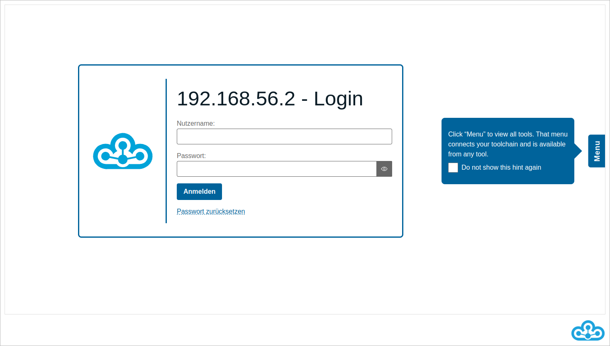
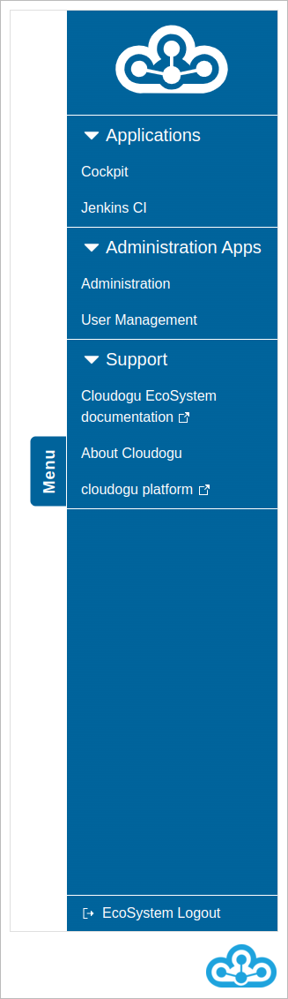
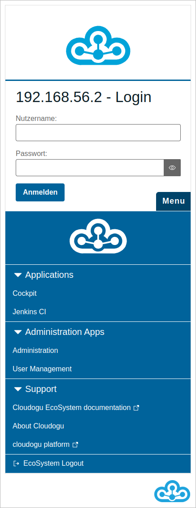
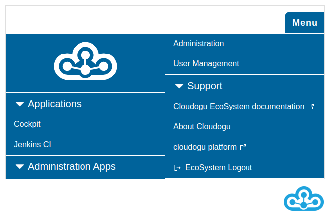

# Documentation

The Warp Menu helps you navigate through the Cloudogu EcoSystem. The Warp Menu allows you to access all dogus and quickly switch between them.

You can open the Warp Menu in any dogu by clicking the "Menu" button on the right side of the screen.

If you are entering the EcoSystem for the first time, you will see a tooltip on the right side of the screen that points to the Warp Menu.
By clicking on it, you can hide it permanently.

If you click on the "Menu" button, you will see the Warp menu with all installed Dogus and other configured
links are displayed. Clicking on the respective link will redirect you to the corresponding application.

The Warp Menu is divided into the following sections:

* Development Apps
* Administration Apps
* Documentation
* Support

In the development apps section you can find the Dogus Jenkins, Redmine, SCM-Manager, SonarQube and Sonatype Nexus and Swagger UI. Under Administration you can find the Dogus Cockpit and User Management. The Dogu Smeagol is located in the Documentation section. Under Support, the About Cloudogu page is linked. In this section you can also find other links. Among others, the user manual for the Cloudogu EcoSystem is linked there.

## Desktop view and mobile view

### Desktop view

In desktop view, i.e. with an appropriately large screen, the Warp Menu is displayed on the right side of the screen.

### Mobile view

In mobile view, i.e. with an appropriately small screen, the Warp menu will be displayed at the bottom of your screen.
Depending on the width of your screen, it will be displayed either in two, three and four columns.

Mobile view on very small devices, e.g. a smartphone.

Mobile view on small devices, e.g. smartphone in landscape mode.

Mobile view on large mobile devices, e.g. tablet in landscape mode.

