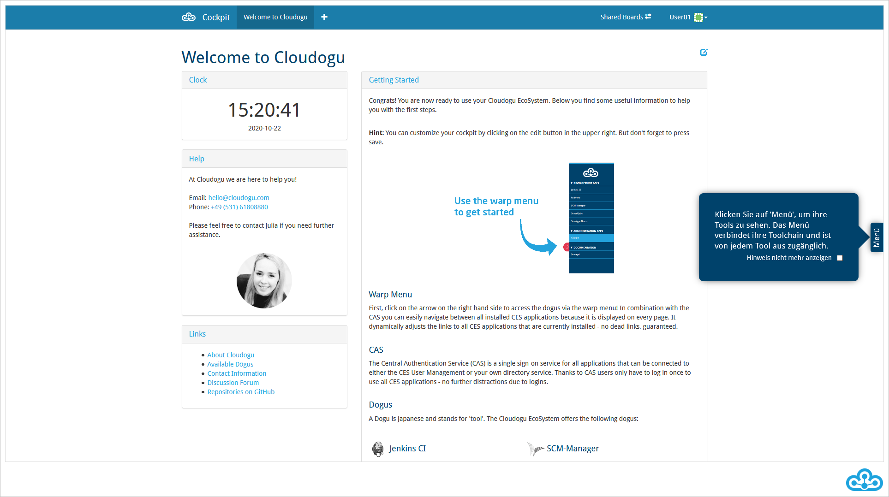
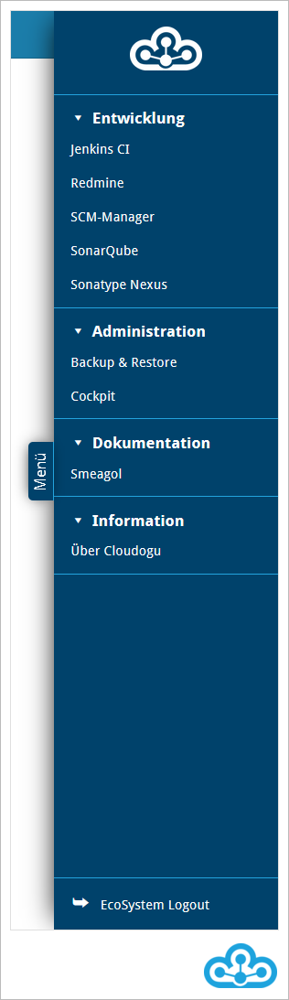
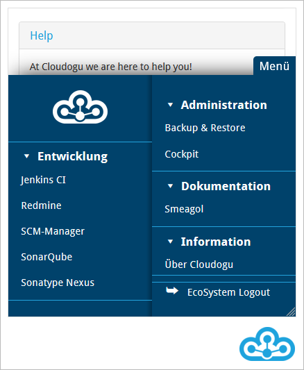
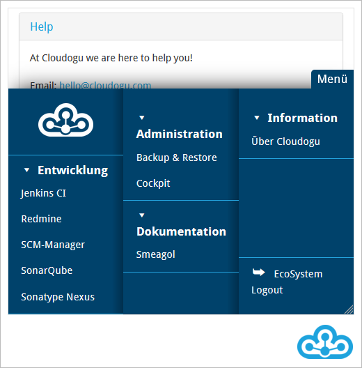
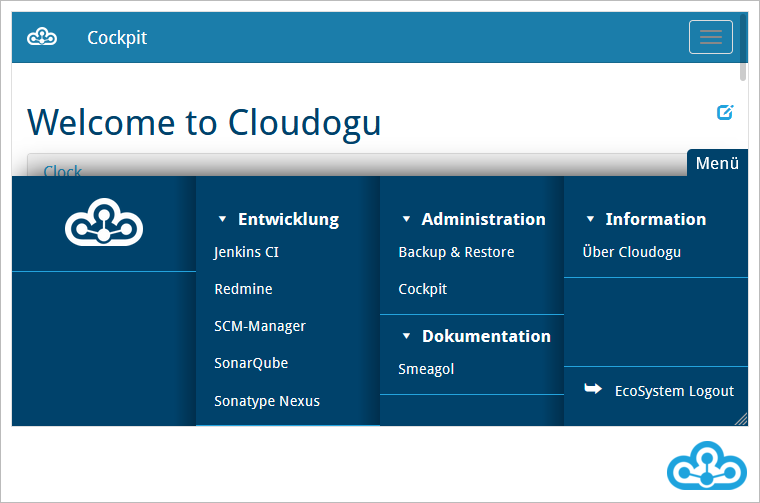

# Warp Menü
Das Warp Menü hilft Ihnen bei der Navigation durch das Cloudogu EcoSystem. Über das Warp Menü können Sie alle  Dogus erreichen und schnell zwischen diesen wechseln.

Das Warp Menü können Sie in jedem Dogu über die Schaltfläche "Menü" am rechten Bildschirmrand öffnen.

Sollten Sie zum ersten Mal das EcoSystem aufrufen, sehen Sie am rechten Bildschirmrand einen Tooltip, welcher auf das Warp Menü hinweist.
Durch einen Klick darauf kann dieser dauerhaft ausgeblendet werden.

Wenn sie auf die Schaltfläche "Menü" klicken, wird Ihnen das Warp Menü mit allen installierten Dogus und weiteren konfigurierten
Links angezeigt. Ein Klick auf den jeweiligen Link leitet Sie auf die entsprechende Anwendung weiter.

Das Warp Menü ist in folgende Bereiche unterteilt:

* Entwicklung
* Administration
* Dokumentation
* Information

Im Bereich Entwicklung befinden sich die Dogus Jenkins, Redmine, SCM-Manager, SonarQube und Sonatype Nexus und Swagger UI. Unter Administration sind die Dogus Cockpit und User Management zu finden. Das Dogu Smeagol befindet sich im Bereich Dokumentation. Unter Information ist die Seite "Über Cloudogu" verlinkt. In diesem Bereich können sich auch weitere Links befinden. Unter anderem ist dort das Benutzerhandbuch zum Cloudogu EcoSystem verlinkt.

## Desktopansicht und mobile Ansicht

### Desktopansicht

In der Desktopansicht, also mit einem entsprechend großen Bildschirm, wird Ihnen das Warp Menü am rechten Bildschirmrand angezeigt.

### Mobile Ansicht

In der mobilen Ansicht, also mit entsprechend kleinem Bildschirm, wird Ihnen das Warp Menü am unteren Bildschirmrand angezeigt.
Abhängig von der Breite Ihres Bildschirmes, wird es entweder in zwei, drei und vier Spalten dargestellt.

Mobile Ansicht auf sehr kleinen Geräten, z.B einem Smartphone.

Mobile Ansicht auf kleinen Geräten, z.B Smartphone im Querformat oder Tablet.

Mobile Ansicht auf großen mobilen Geräten, z.B Handy im Querformat oder Tablet.

